

<a href="https://github.com/MohammedNoorDehalvi">
  
</a>

 

  

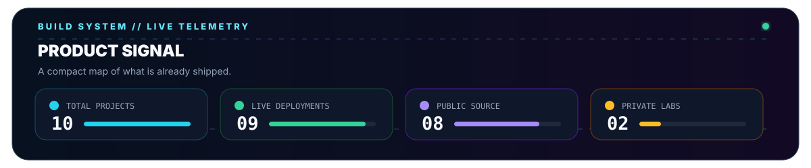

  

<table>
  <tr>
    <td width="50%" align="center">
      <a href="https://apl-delta.vercel.app/">
        
      </a>
       
      
    </td>
    <td width="50%" align="center">
      <a href="https://3-d-sandy.vercel.app/">
        
      </a>
       
      
    </td>
  </tr>
  <tr>
    <td width="50%" align="center">
      <a href="https://prompt-enhancer-six-psi.vercel.app/">
        
      </a>
       
      
    </td>
    <td width="50%" align="center">
      <a href="https://teen-talk-delta.vercel.app/">
        
      </a>
       
      
    </td>
  </tr>
  <tr>
    <td colspan="2" align="center">
      <a href="https://teen-talk-2.vercel.app/">
        
      </a>
       
      
    </td>
  </tr>
</table>

  

  

<table>
  <tr>
    <td colspan="2" align="center">
      <a href="https://github.com/MohammedNoorDehalvi/noor-ai-studio">
        
      </a>
       
      
    </td>
  </tr>
  <tr>
    <td width="50%" align="center">
      <a href="https://self-fitness-app.vercel.app/">
        
      </a>
       
      
    </td>
    <td width="50%" align="center">
      <a href="https://continentalgourmet.shop/">
        
      </a>
       
      
    </td>
  </tr>
  <tr>
    <td width="50%" align="center">
      <a href="https://project-manager-two-lovat.vercel.app/">
        
      </a>
       
      
    </td>
    <td width="50%" align="center">
      <a href="https://local-work-tracker.vercel.app/">
        
      </a>
       
      
    </td>
  </tr>
</table>

<picture>
  <source media="(prefers-color-scheme: dark)" srcset="https://github-readme-stats.vercel.app/api?username=MohammedNoorDehalvi&amp;show_icons=true&amp;hide_border=true&amp;rank_icon=github&amp;bg_color=07111f&amp;title_color=22d3ee&amp;text_color=cbd5e1&amp;icon_color=a78bfa" />
  <source media="(prefers-color-scheme: light)" srcset="https://github-readme-stats.vercel.app/api?username=MohammedNoorDehalvi&amp;show_icons=true&amp;hide_border=true&amp;rank_icon=github&amp;bg_color=f8fafc&amp;title_color=0369a1&amp;text_color=334155&amp;icon_color=7c3aed" />
  
</picture>
<picture>
  <source media="(prefers-color-scheme: dark)" srcset="https://github-readme-stats.vercel.app/api/top-langs/?username=MohammedNoorDehalvi&amp;layout=compact&amp;hide_border=true&amp;bg_color=07111f&amp;title_color=a78bfa&amp;text_color=cbd5e1" />
  <source media="(prefers-color-scheme: light)" srcset="https://github-readme-stats.vercel.app/api/top-langs/?username=MohammedNoorDehalvi&amp;layout=compact&amp;hide_border=true&amp;bg_color=f8fafc&amp;title_color=7c3aed&amp;text_color=334155" />
  
</picture>

  

<picture>
  <source media="(prefers-color-scheme: dark)" srcset="https://github-readme-activity-graph.vercel.app/graph?username=MohammedNoorDehalvi&amp;bg_color=07111f&amp;color=cbd5e1&amp;line=22d3ee&amp;point=a78bfa&amp;area=true&amp;hide_border=true&amp;radius=16" />
  <source media="(prefers-color-scheme: light)" srcset="https://github-readme-activity-graph.vercel.app/graph?username=MohammedNoorDehalvi&amp;bg_color=f8fafc&amp;color=334155&amp;line=0369a1&amp;point=7c3aed&amp;area=true&amp;hide_border=true&amp;radius=16" />
  
</picture>

 

